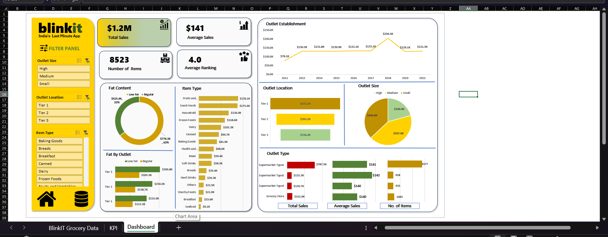

# 🛒 BlinkIT Grocery Sales Analysis Dashboard (Microsoft Excel)

## 📖 Project Description

This project is an **interactive sales analysis dashboard** built using **Microsoft Excel** to analyze BlinkIT grocery sales data. The dashboard converts raw transactional data into meaningful business insights using Excel's powerful analytical features such as **Pivot Tables, Pivot Charts, Slicers, KPI Cards, Conditional Formatting, and Excel Formulas**.

The goal of this project is to help businesses understand their sales performance, customer preferences, outlet performance, and product trends through an easy-to-use and interactive dashboard.

---

# 🎯 Objectives

The primary objectives of this project are:

* Analyze grocery sales performance.
* Track important business KPIs.
* Compare sales across different product categories.
* Understand customer purchasing behavior.
* Evaluate product performance based on Fat Content.
* Build an interactive dashboard for business decision-making.
* Improve reporting efficiency using Microsoft Excel.

---

# 🧰 Tools & Technologies

* Microsoft Excel
* Pivot Tables
* Pivot Charts
* Slicers
* KPI Cards
* Excel Formulas
* Conditional Formatting
* Data Cleaning
* Data Visualization

---

# 📂 Dataset Information

The dataset contains **8,523 grocery sales records** with **13 attributes**.

### Dataset Columns

* Item Fat Content
* Item Identifier
* Item Type
* Outlet Establishment Year
* Outlet Identifier
* Outlet Location Type
* Outlet Size
* Outlet Type
* Item Visibility
* Item Weight
* Sales
* Rating

The dataset represents grocery products sold through different outlet types and locations.

---

# 📊 Dashboard KPIs

The dashboard displays the following Key Performance Indicators:

| KPI              |         Value |
| ---------------- | ------------: |
| 💰 Total Sales   | ₹1,201,681.49 |
| 📦 Total Orders  |         8,523 |
| 💵 Average Sales |       ₹140.99 |
| ⭐ Average Rating |      3.97 / 5 |

These KPIs provide a quick overview of overall business performance.

---

# 📈 Dashboard Features

## 1️⃣ Sales Overview

Displays the overall business performance using KPI cards.

### Includes:

* Total Sales
* Total Orders
* Average Sales
* Average Rating

---

## 2️⃣ Sales by Fat Content

Compares total sales between:

* Low Fat Products
* Regular Products

This analysis helps identify customer purchasing preferences.

---

## 3️⃣ Interactive Filters

The dashboard uses **Excel Slicers** to make analysis dynamic.

Users can filter the dashboard by different categories and instantly update all visualizations.

---

## 4️⃣ Pivot Table Analysis

The dashboard is powered by Pivot Tables, allowing efficient summarization of large datasets and fast reporting.

---

# 🧹 Data Cleaning Process

Before building the dashboard, the data was prepared by:

* Removing duplicate records
* Checking missing values
* Standardizing text values
* Organizing the dataset into a structured format
* Creating Pivot Tables for analysis

---

# 📌 Business Insights

Some important insights obtained from the dashboard include:

* Total sales reached **₹1.2 Million**.
* More than **8,500 grocery transactions** were analyzed.
* Average customer rating is **3.97**, indicating generally positive customer feedback.
* **Low Fat products** generated significantly higher sales than **Regular products**.
* Interactive filters make it easy to explore performance across different dimensions.

---

# 💼 Business Value

This dashboard helps businesses:

* Monitor sales performance
* Identify top-performing product categories
* Compare product demand
* Understand customer satisfaction
* Support data-driven decision making
* Generate reports quickly without manual calculations

---

# 🚀 Skills Demonstrated

This project demonstrates practical knowledge of:

* Microsoft Excel
* Data Cleaning
* Exploratory Data Analysis (EDA)
* Pivot Tables
* Pivot Charts
* Dashboard Design
* Business Intelligence
* KPI Reporting
* Data Visualization
* Interactive Reporting

---

# 📁 Project Structure

```text
BlinkIT-Grocery-Excel-Dashboard/
│
├── BlinkIT Grocery Data Excel.xlsx
├── README.md
├── Dashboard.png
└── Dataset Screenshot.png
```

---

# 📸 Dashboard Preview

> Add screenshots of your Excel dashboard here.

Example:

```markdown

```

---

# 🎓 Learning Outcomes

Through this project, I learned how to:

* Clean and prepare real-world sales data.
* Build professional Excel dashboards.
* Create KPI reports.
* Analyze business performance using Pivot Tables.
* Develop interactive reports using Slicers.
* Present business insights through data visualization.

---

# 👨‍💻 Author

**Dhammdeep Vathore**

**Aspiring Data Analyst**

### Technical Skills

* Microsoft Excel
* SQL
* Power BI
* Tableau
* Python
* Pandas
* NumPy
* Data Analysis
* Dashboard Development
* Data Visualization

---

## ⭐ Support

If you found this project helpful or interesting, please consider giving this repository a **Star**. Your support is greatly appreciated!
